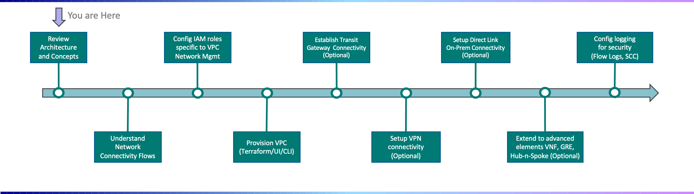

---

copyright:
  years: 2022, 2023, 2023
lastupdated: "2023-06-20"

subcollection: vpc-journey

---

{{site.data.keyword.attribute-definition-list}}

# Deployment Journey Overview
{: #vpc-overview}

{{site.data.keyword.vpc_full}}(VPC) allows you to establish your own virtual private cloud by defining a virtual network that is logically isolated from all other public cloud tenants. The underlying software defined networking (SDN) and virtual network functions allows you to quickly establish the network constructs and on-prem connectivity needed to run your workload. The information contained within this document is meant to serve as a technical guide for beginning with a new {{site.data.keyword.Bluemix_notm}} Account and leading towards a fully configured VPC network environment.
{: shortdesc}

Welcome to the Deployment Journey for VPC on {{site.data.keyword.Bluemix_notm}}! Use the sidebar on the left to navigate between the journey points.
{: tip}

## Journey Map
{: #vpc-overview-map}
{: class="center"}

## Assumptions
{: #vpc-overview-assumptions}

This deployment guide  will be assuming the following points. Please note that while your circumstance may not be exactly identical, you will still benefit from the overall journey steps and concepts covered in this guide.

- You are already familar with the concepts introduced in the "Tour {{site.data.keyword.Bluemix_notm}}" videos available on the [Getting Started with {{site.data.keyword.Bluemix_notm}}](https://{DomainName}/cloud/get-started)  page.

- Access groups will need to be defined so only certain users have the ability to create and manage the VPC network settings (i.e. CIDR ranges, Subnet ACL rules, etc.,).

- You have a networking background and familar with concepts such as IP Addressing, subnets, routing, etc.,

- Focus will be on establishing the underlying network connectivity to support VPC based workloads.

  - Note: A separate deployment guide will cover the compute resources which runs within the VPC like IBM Kubernetes Services (IKS), Red Hat OpenShift, IBM Code Engine, and VPC Virtual Server Instances (VSIs).

- Deployment will start small (i.e. single multi-zone VPC) but will grow to multiple VPCs, so interconnectivity among the VPCs will be required (and may even span across multiple {{site.data.keyword.Bluemix_notm}} accounts).

- Private connectivity to resources outside the VPC is needed. This includes {{site.data.keyword.Bluemix_notm}} Services and potentially on-prem resources.

  
## Understanding {{site.data.keyword.Bluemix_notm}} VPC Concepts
{: #vpc-overview-concepts}

{: video output="iframe" data-script="none" id="youtubeplayer" frameborder="0" webkitallowfullscreen mozallowfullscreen allowfullscreen}

## Next Steps
{: #vpc-overview-next-steps}
The next step on the deployment journey is:
* [Understanding Network Flows](/docs/vpc-journey?topic=vpc-journey-vpc-network-flows)

