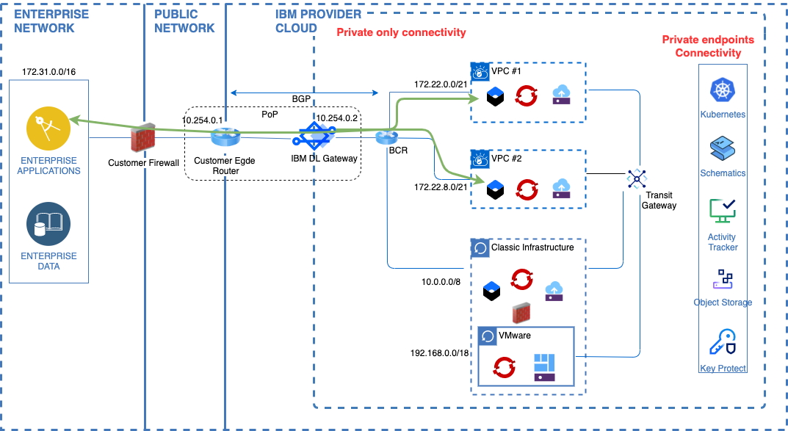
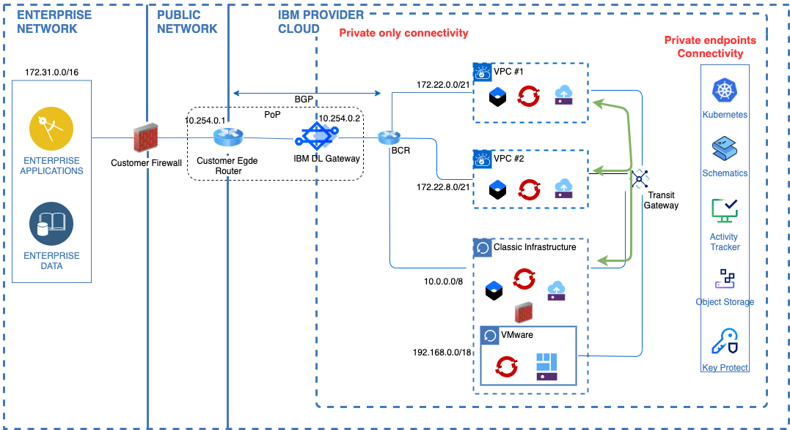
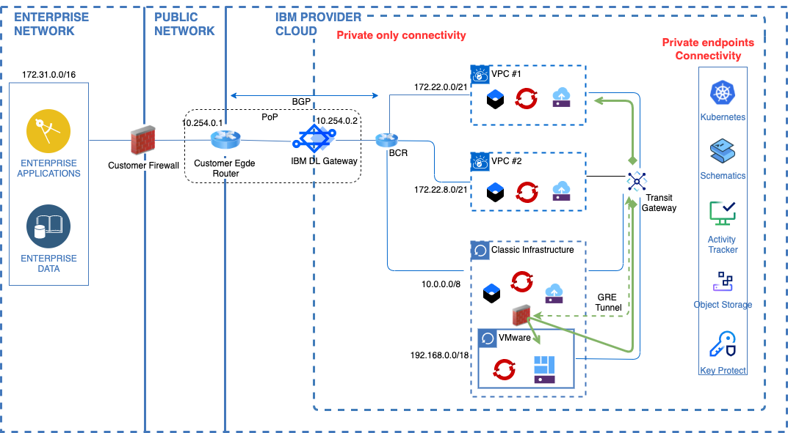
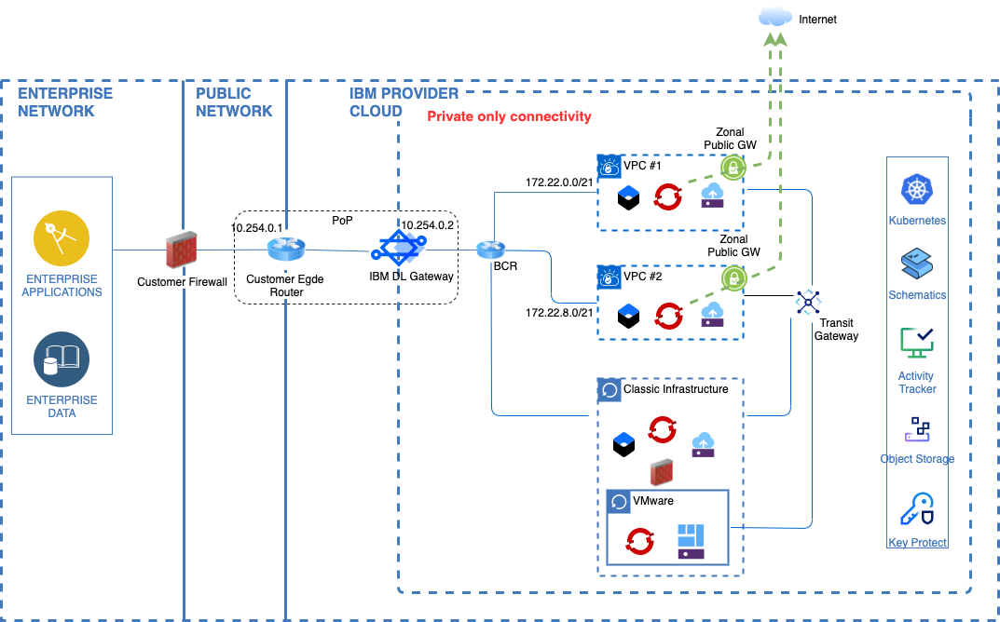
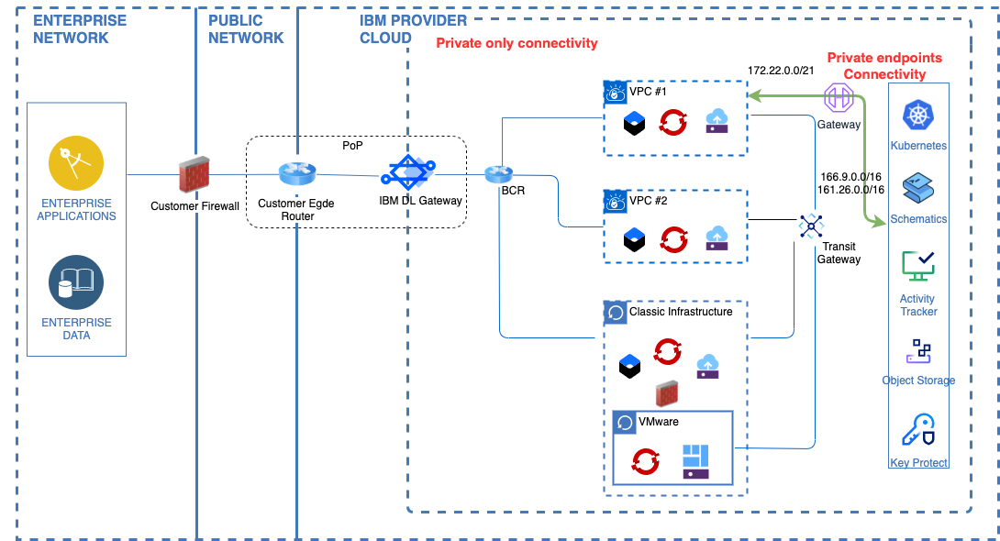

---

copyright:
  years: 2021, 2022
lastupdated: "2022-02-18"

subcollection: vpc-journey

---

{{site.data.keyword.attribute-definition-list}}

# Understanding Network Flows
{: #vpc-network-flows}

Before provisioning your VPC network, it's important to understand what your connectivity requirements will be. Are you an existing {{site.data.keyword.Bluemix_notm}} Classic Infrastructure user which requires connectivity to those resources? Will you require private connectivity to on-prem resources? How will interconnectivity between multiple VPCs be managed?  In this section of the deployment guide, the underlying network flows which support these types of scenarios will be reviewed.
{: shortdesc}

Taking the time to understand and plan network flows is a key ingredient to successful deployment. As you review this section, consider the connectivity requirements you have today but may also need in the future.
{: tip}

## Journey Map
{: #vpc-network-flows-map}
{: class="center"}

## Overview
{: #vpc-network-flows-video-walkthrough}

The following network flows will be covered. Please note that while these represent some common connectivity requirements, not all may be required in your environment. 

1. **VPC to/from On-Prem** connectivity allows for private communication between your on-prem network and the cloud based VPC network, and allows you to access VPC based resources as if they were running locally. The connection also provides a private path for VPC based applications to communicate back to resources on your local network.
2. **VPC to/from VPC and/or Classic Infrastructure** connectivity allows for private communication between multiple VPCs via transit gateway. If you have existing resources still running on the {{site.data.keyword.Bluemix_notm}} Classic Infrastructure, a similar flow can also be used to facilitate communication between VPC and Classic infrastructure resources. 
3. **VPC to/from VMware (in Classic Infrastructure)** connectivity allows for private communication between your VPC and Virtual Machines (VMs) running in an {{site.data.keyword.Bluemix_notm}} VMware on Classic Infrastructure environment. Typically, in a VMware deployment, an overlay network is defined which allows for BYOIP. This network flow allows for connectivity with this overlay network by establishing connectiivity between Classic infrastructure and VPC using transit gateway and running GRE tunnel between the VMware's edge router and Transit gateway for overlay communication.
4. **VPC to Internet** connectivity provides for communication from within the VPC to the public Internet.  This network flow leverages a public gateway to allow for egress traffic. Note the traffic flow is one-way.
5. **VPC to Cloud Service Private Endpoints** connectivity provides for private communication from within the VPC to {{site.data.keyword.Bluemix_notm}} Service private endpoints. Note the traffic flow is one-way (meaning an {{site.data.keyword.Bluemix_notm}} Service cannot initiate a connection into a resource in your VPC).

Additional details for each of these network flows can be found below. 

## Flow1: On-Prem to VPC
{: #vpc-network-flows-1}

## Flow2: VPC to VPC and/or Classic Infrastructure
{: #vpc-network-flows-2}

## Flow3: VPC to VMware (Overlay Network for VMs)
{: #vpc-network-flows-3}

## Flow4: VPC to Internet
{: #vpc-network-flows-4}

## Flow5: VPC to Cloud Service Private Endpoints
{: #vpc-network-flows-5}

## Next Steps
{: #vpc-network-flows-next-steps}
The next step on the deployment journey is:
* [Configure IAM Roles](/docs/vpc-journey?topic=vpc-journey-vpc-iam-roles)
