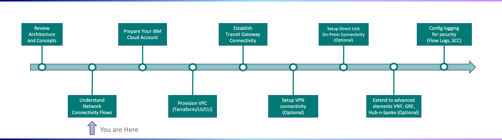

---

copyright:
  years: 2021
lastupdated: "2021-11-30"

subcollection: vpc-journey

---

{{site.data.keyword.attribute-definition-list}}

# Understanding Network Flows
{: #vpc-network-flows}

IBM Cloud for VPC...... 
{: shortdesc}

Taking the time to understand and plan network flows is a key ingredient to successful deployment. As you review this section, consider the connectivity requirements you have today but may also need in the future.
{: tip}

## Journey Map
{: #vpc-network-flows-map}
{: class="center"}

## Overview
{: #vpc-network-flows-video-walkthrough}

Introduce the network flows here......

1. On-Prem to VPC connectivity. 
2. VPC to VPC and/or Classic Infrastructure connectivity.
3. VPC to VMware connectivity.
4. VPC to Internet connectivity.
5. VPC to Cloud Service Private Endpoints connectivity.

## Detailed Flows
{: #vpc-network-flows-details}

In this section, detailed network flows will be reviewed. The following network architecture will be broken down into five different flows:

{: class="center"}

**Flow1: On-Prem to VPC**
{: class="center"}

**Flow2: VPC to VPC and/or Classic Infrastructure**
{: class="center"}

**Flow3: VPC to VMware (Overlay Network for VMs)**
{: class="center"}

**Flow4: VPC to Internet**
{: class="center"}

**Flow5: VPC to Cloud Service Private Endpoints**
{: class="center"}

## Next Steps
{: #vpc-network-flows-next-steps}
The next step on the deployment journey is:
* [Configure IAM Roles](/docs/vpc-journey?topic=vpc-journey-vpc-iam-roles)
