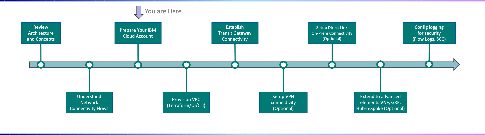

---

copyright:
  years: 2021, 2022
lastupdated: "2022-03-24"

subcollection: vpc-journey

---

{{site.data.keyword.attribute-definition-list}}

# Prepare Your {{site.data.keyword.Bluemix_notm}} Account
{: #vpc-prep-account}

## Journey Map
{: #vpc-prep-account-map}
{: class="center"}

## Setup Resource Group

{: #vpc-prep-account-resource-groups}

Resource Groups allow you to organize the resources/instances into groups (i.e. ProjectA_VPC, ProjectB_VPC, Dev_Env, Prod_Env, etc.), and can be used as part of the access management strategy (i.e. Developers granted access to resources in Dev_Env resourcce group but no access to Prod_Env). When a VPC is provisioned, it must be placed within a resource group. Please refer to the follow assets to understand the best practices for using resource groups:

- [Best practices for resource groups and assigning access](https://{DomainName}/docs/account?topic=account-account_setup)

## Configure IAM
{: #vpc-prep-account-iam}

IBM Identity and Access Management (IAM) should be planned ahead and configured before the provisioning of a VPC on {{site.data.keyword.Bluemix_notm}}. Typically, only users which serve as Network Admins should have access to create and manage the VPC (i.e. you may want to allow users view and create resources within the VPC but probably do not want them changing your VPC network/IP configuration). Please refer to the follow assets to understand IAM concepts and required permissions:

- [Understand IAM Concepts in the {{site.data.keyword.Bluemix_notm}}](https://{DomainName}/docs/account?topic=account-iamoverview)

- [Getting Start with IAM and VPC](https://{DomainName}/docs/vpc?topic=vpc-iam-getting-started)

- [Walk-Through Scenarios for Setting VPC Permissions](https://{DomainName}/docs/vpc?topic=vpc-managing-user-permissions-for-vpc-resources#team-access-scenario)

- [List of IAM Permissions Needed to Perform an Action on a VPC Resource](https://{DomainName}/docs/vpc?topic=vpc-resource-authorizations-required-for-api-and-cli-calls)

{: class="center"}

## Understand VPC Quota and limitations:
{: #vpc-prep-quotas-limits}

IBM Cloud limits the VPC resources provisioned per account per region per vpc by default. Default quotas are set and can be increased by support ticket.

* [VPC quotas and limits](https://https://{DomainName}/docs/vpc?topic=vpc-quotas)

## Next Steps
{: #vpc-prep-account-next-steps}

The next step on the deployment journey is:

* [Provision VPC](/docs/vpc-journey?topic=vpc-journey-vpc-provisioning)
