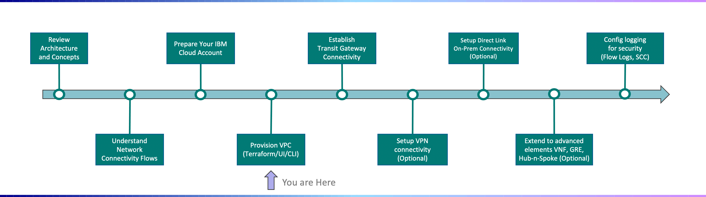
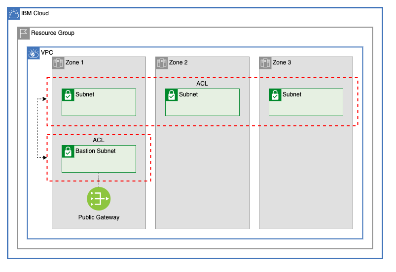
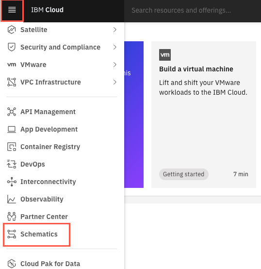

---

copyright:
  years: 2021
lastupdated: "2021-11-30"

subcollection: vpc-journey

---

{{site.data.keyword.attribute-definition-list}}

# Provision VPC
{: #vpc-provisioning}

IBM Cloud for VPC...... 
{: shortdesc}

## Journey Map
{: #vpc-provisioning-map}
{: class="center"}

## Overview
{: #vpc-provisioning-overview}

Provisioning of a VPC can be accomplished via the IBM Cloud Portal User Interface, IBM Cloud CLI, or via Terraform.  In this deployment guide, automation using Terraform will be the focus. 

If you are brand new to IBM Cloud, a  [video](https://www.youtube.com/watch?v=pGLgtB193cI) showing how to use Portal UI to create a VPC may be a good first step to orient yourself around some of the concepts.  However, as you start to create multiple VPCs and want to leverage consistent repeatable patterns, you'll find Terrform automation to be more efficient.
{: tip}

To get started, the following Multi-zone VPC architecture will be used.
{: class="center"}

## Getting Started
{: #vpc-provisioning-getting-started}

IBM Cloud Schematics allows you to "run terraform in the cloud" and provides a centralized location to manage the terraform state files and logs.
{: tip}

### Import VPC Terraform Code to Schematics
{: #vpc-provisioning-create-schematics-workspace}

1. Login to cloud.ibm.com and navigate to the IBM Schematics service as shown in the figure below:

2. From the Schematics Workspace tab, choose to create a new project workspace.

3. Schematics can automatically pull terraform code from a GitHub repo. Enter "https://github.com/Cloud-Schematics/gcat-multizone-vpc-bastion-subnet" as the repository URL (which represents the VPC architecture depicted above) and select Terraform v0.15.

4. Specify the workspace details values based on your preferences.

5. Validate the information entered and click Create to retrieve the Terraform code and create the Schematics workspace.

### Configure Terraform Variables
{: #vpc-provisioning-config-schematics-workspace}  

1. Login to cloud.ibm.com and navigate to the IBM Schematics service as shown in the figure below:

### Apply VPC Terraform Code
{: #vpc-provisioning-apply-schematics-workspace}  

1. Login to cloud.ibm.com and navigate to the IBM Schematics service as shown in the figure below:

## Additional VPC Terraform Architecture Patterns
{: #vpc-provisioning-additional-patterns}

The following site

## Next Steps

{: #vpc-overview-next-steps}
The next step on the deployment journey is:
* [Establish Transit Gateway Connectivity](/docs/vpc-journey?topic=vpc-journey-vpc-tgw)
