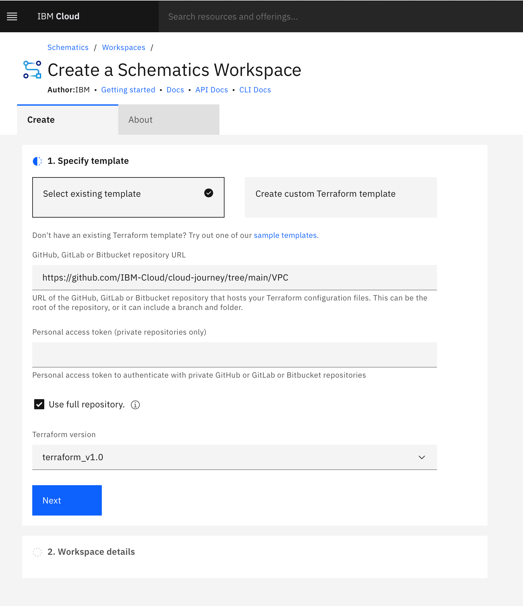
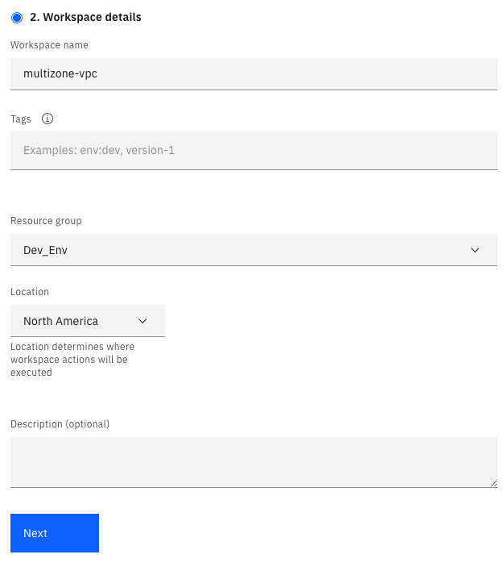
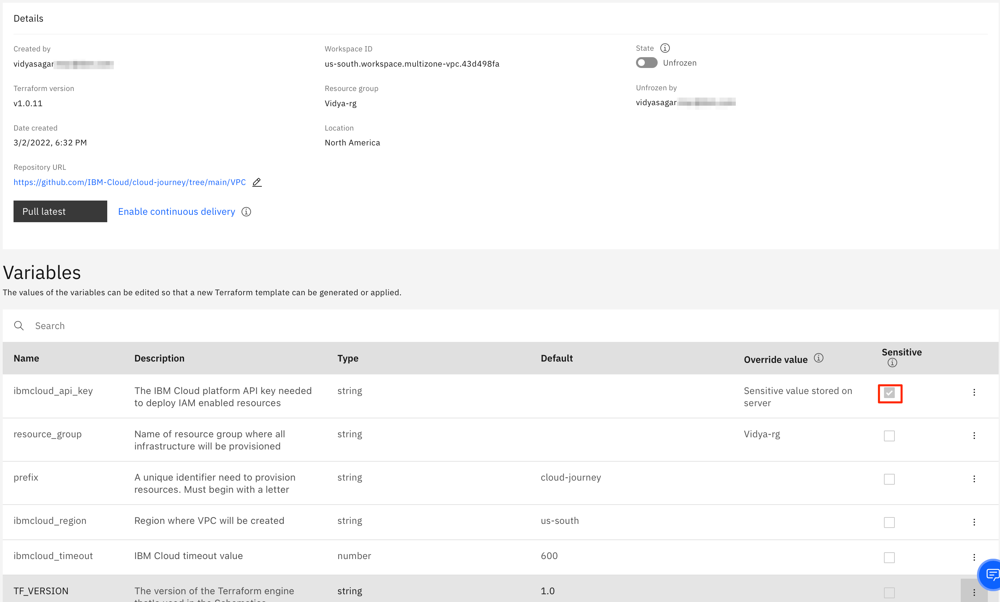
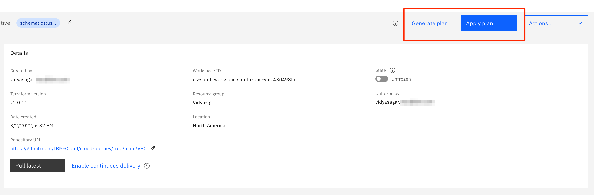

---

copyright:
  years: 2022
lastupdated: "2022-08-20"

subcollection: vpc-journey

---

{{site.data.keyword.attribute-definition-list}}

# Provision VPC
{: #vpc-provisioning}

## Journey Map
{: #vpc-provisioning-map}
{: class="center"}

## Overview
{: #vpc-provisioning-overview}

Provisioning of a VPC can be accomplished via the {{site.data.keyword.Bluemix_notm}} Portal User Interface, {{site.data.keyword.Bluemix_notm}} CLI, or via Terraform.  In this deployment guide, automation via Terraform will be leveraged. 

If you are brand new to {{site.data.keyword.Bluemix_notm}}, a [video](https://www.youtube.com/watch?v=pGLgtB193cI) showing how to use Portal UI to create a VPC may be a good first step to orient yourself around some of the concepts.  However, as you start to create multiple VPCs and want to leverage consistent repeatable patterns, you'll find Terrform automation to be more efficient.
{: tip}

To get started, the following Multi-zone VPC architecture will be used.
{: class="center"}

## Getting Started
{: #vpc-provisioning-getting-started}

{{site.data.keyword.Bluemix_notm}} Schematics allows you to "run terraform in the cloud" and provides a centralized location to manage the terraform state files and logs.
{: tip}

### Import VPC Terraform Code to Schematics
{: #vpc-provisioning-create-schematics-workspace}

1. Login to {{site.data.keyword.Bluemix_notm}} and navigate to the IBM Schematics service as shown in the figure below: 
   

2. From the Schematics Workspace tab, choose to create a new project workspace. 

3. Schematics can automatically pull terraform code from a GitHub repo. Enter `https://github.com/IBM-Cloud/cloud-journey/tree/main/VPC` as the repository URL (which represents the VPC architecture depicted above) and select **terraform_v1.0**.
    

4. Specify the workspace details values based on your preferences. 

   As a best practice, do NOT use the "default" resource group.  Create a resource group for this network or project provides more flexibility. For additional details see the [Preparing Your {{site.data.keyword.Bluemix_notm}} Account](/docs/vpc-journey?topic=vpc-journey-vpc-prep-account) page of this deployment journey guide.
   {: tip}

5. Validate the information entered and click **Create** to retrieve the Terraform code and create the Schematics workspace.

### Configure Terraform Variables
{: #vpc-provisioning-config-schematics-workspace}  

1. If not already there, navigate to the **Settings** page of your new Schematics workspace where you will see a list of variables (and their default values) which were found in the Terraform code.

2. Enter a value for the {{site.data.keyword.Bluemix_notm}} API Key variable (if it exists) by clicking on the action menu.
   

   The API key is the credential the terraform code will run under and may we associated with a userid or a serviceid. To generate an API Key, click on Manage (located in top menu bar), select IAM, and then API keys. When entering the value in Schematics, be sure to select the "Sensitive" checkbox.
   {: tip}

3. Inspect the remaining variables and update the values as needed. For example, you will most likely need to update the resource group name.

   Refer to the readme which accompanies the Terraform code for descriptions on variable names and their usage. In this example, you will see variables for configuring the subnet tiers, whether or not public gateways for a zone are enabled, subnet acl rules, etc.
   {: tip}

### Apply VPC Terraform Code
{: #vpc-provisioning-apply-schematics-workspace}  

1. Click the **Generate plan** to validate the configuration. This is similar to running `terraform plan` when using the CLI. No changes will be made nor any resources deployed. This will only perform a test run. 
   

2. If the generate action completes successfully, click on the **Apply plan** button to provision this cloud native configuration on VPC. 

3. Once the apply plan completes successfully, click on the menu icon (located in the top left corner) and navigate to the VPC Infrastructure page to browse your newly created VPC instance! 

4. (Optional) If you would like to delete/destroy the VPC resources which was created, go back to the Schematics Workspace and select **Actions** > **Destroy resources**. 
   

## Additional VPC Deployment Patterns and Resources
{: #vpc-provisioning-additional-patterns}

Now that you understand how to deploy a VPC, explore some additional deployment patterns using the resources below:

- [Multi-Zone VPC](https://github.com/Cloud-Schematics/gcat-multizone-vpc)

- [{{site.data.keyword.Bluemix_notm}} Tutorials - Public Frontend and Private Backend Subnets](https://{DomainName}/docs/solution-tutorials?topic=solution-tutorials-vpc-public-app-private-backend)

- [Hub-n-Spoke VPC](/docs/vpc-journey?topic=vpc-journey-vpc-advanced-elements)

## Next Steps
{: #vpc-overview-next-steps}

The next step on the deployment journey is:
* [Establish Transit Gateway Connectivity](/docs/vpc-journey?topic=vpc-journey-vpc-tgw)
