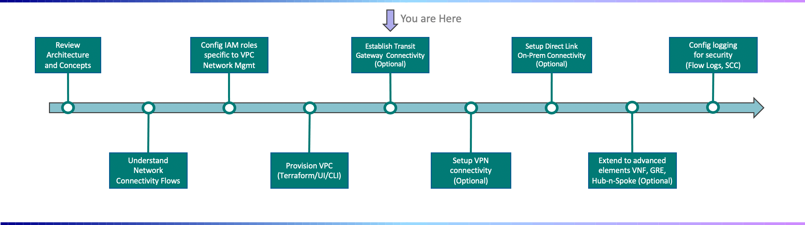
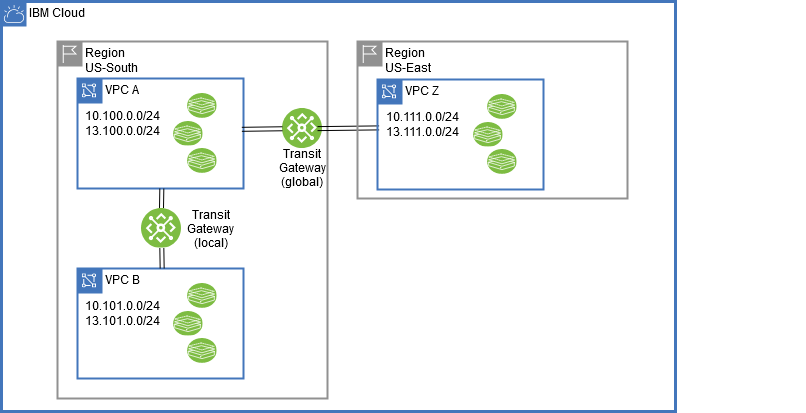
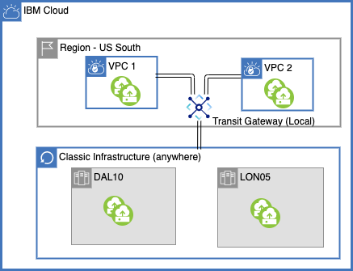

---

copyright:
  years: 2021
lastupdated: "2021-12-06"

subcollection: vpc-journey

---

{{site.data.keyword.attribute-definition-list}}

# Establish Transit Gateway Connectivity
{: #vpc-tgw}

## Journey Map
{: #vpc-tgw-map}
{: class="center"}

 

## Overview
{: #vpc-tgw-overview}

The IBM Cloud VPC Transit Gateway allows you to establish inter-connectivity with your VPCs. Using Transit Gateway, you can establish connections between your VPC and:

- **Other VPCs** - Allows to communication to resources in other VPCs within the same region or in other regions
- **IBM Cloud Classic Infrastructure** - Allows for communication to resources still running on IBM Cloud Classic Infrastructure
- **Direct Link** - Allows for communication to on-prem resources

The following example depicts how Transit Gateway devices can be used to connect VPCs together.

   {: class="center"}
   

The following example depicts how Transit Gateway devices can be used to connect VPC to classic infrastructure together.
**Note** - Classic infrastructure resource from any region can be acceesible to local Transit Gateway
    
   {: class="center"}

For additional details on how to configure a Transit Gateway, along with some scenario, please refer to the [documentation](https://{DomainName}/docs/transit-gateway?topic=transit-gateway-about)

## Next Steps
{: #vpc-tgw-next-steps}

The next step on the deployment journey is:

* [Setup VPN Connectivity](/docs/vpc-journey?topic=vpc-journey-vpc-vpn)
