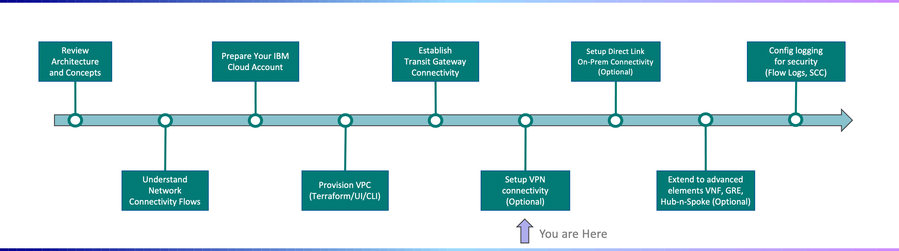

---

copyright:
  years: 2021
lastupdated: "2021-11-30"

subcollection: vpc-journey

---

{{site.data.keyword.attribute-definition-list}}

# Setup VPN Connectivity
{: #vpc-vpn}

Client to Site VPN provides the ability for users to establish a private connection between their device and VPCs running in IBM Cloud.  
{: shortdesc}

## Journey Map
{: #vpc-vpn-map}
{: class="center"}

## Detailed Steps
{: #vpc-vpn-detailed-steps}

1. Create an IAM access group following steps detailed [here](https://{DomainName}/docs/vpc?topic=vpc-client-to-site-authentication#creating-cert-manager-instance-import) 

   

2. Download any supported VPN client software found [here](https://{DomainName}/docs/vpc?topic=vpc-client-to-site-vpn-planning#vpn-client-software) (example was done using OpenVPN)

   

3. Go to https://{DomainName}/vpc-ext/provision/vpnserver to create the VPN

   

4. Fill in client IP pool making sure to follow to the [client IP rules](https://{DomainName}/docs/vpc?topic=vpc-client-to-site-vpn-planning) 

   

5. Add your certificate manager which can be created using these [steps](https://{DomainName}/docs/vpc?topic=vpc-client-to-site-authentication#creating-cert-manager-instance-import) 

   

6. Select either 2 subnets for high availibility or 1 subnet for standalone 

   

7. Authentication can be userID and passcode or using client certificate or both for the most security 

   

8. Finish creating the VPN and download the client profile 

   

9. Go to the VPN server routes tab and follow [route creation guide](https://{DomainName}/docs/vpc?topic=vpc-vpn-client-to-site-routes&interface=ui#create-route-ui)  

   

10. If the VPN uses client certificate for authorization:  

    - [Client certificate authoization steps](https://{DomainName}/docs/vpc?topic=vpc-vpn-client-environment-setup&interface=ui)

    - Edit the .ovpn file just downloaded using any text editor with the necessary information from the client certificates that were created in step 4

      
11. Upload the .ovpn to your respective VPN client software

12. If the VPN uses userID and passcode for authorization:  

    - Set userID to the email used for IAM authorization. 

    - [Generate passcode](https://iam.cloud.ibm.com/identity/passcode)

    - Don't worry if a connection error: "missing external certificate" pops up, just press continue 

      
13. Resources on your VPC should now be accessible!  

    NOTE: Make sure to add a new rule to the VPC security group to allow inbound traffic for the protocol and port chosen under additional configurations. If nothing was chosen, the defaults are UDP at port 443. 

## Next Steps

{: #vpc-overview-next-steps}
The next step on the deployment journey is:
* [Setup Direct Link Connectivity](/docs/vpc-journey?topic=vpc-journey-vpc-directlink)