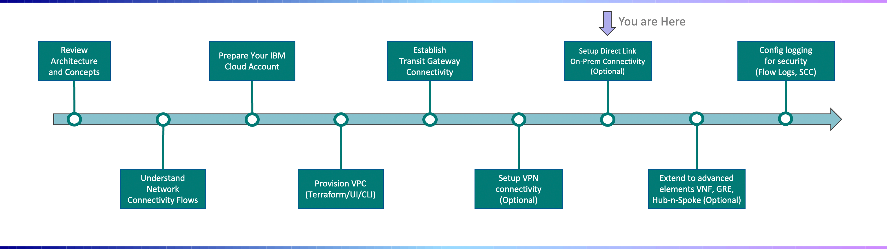

---

copyright:
  years: 2021
lastupdated: "2021-12-01"

subcollection: vpc-journey

---

{{site.data.keyword.attribute-definition-list}}

# Setup Direct Link Connectivity
{: #vpc-directlink}

## Journey Map
{: #vpc-directlink-map}
{: class="center"}

## Overview
{: #vpc-directlink-overview}

IBM Cloud Direct Link **provides private connectivity between VPC and on-prem** and is available via the following packages:

- IBM Cloud Direct Link Connect (DL 2.0)
- IBM Cloud Direct Link Dedicated (DL 2.0)
- IBM Cloud Direct Link Dedicated Hosting on Classic (DL 1.0)
- IBM Cloud Direct Link Dedicated Exchange on Classic (DL 1.0)

TODO: Add section about DC locations vs POPs

Direct Link is available in two generations, 1.0 and 2.0. "Classic" and "1.0" refer to the same thing. Details on what is different between the generations are described below: 

| Feature                                     | Direct Link (2.0)                                            |
| ------------------------------------------- | ------------------------------------------------------------ |
| Locations                                   | All MZRs have Direct Link (2.0) offering support. SZR support is being rolled out on a location-by-location basis. |
| MACsec                                      | MACsec support is available in CHI01 and WDC02. Compatible with Cisco switches. |
| 100G NNI                                    | Business case justification required. In roadmap for MZR’s and associated POP’s pending business/finance approval |
| IBM Cloud Account in VRF                    | If the account is used for VPC connectivity only, there is no need to migrate to VRF. If SoftLayer classic network connectivity is required, then the account needs a VRF migration. |
| BGP Authentication                          | Supported for Dedicated and Connect offerings through automation. Need to store the MD5 secret in Key Protect or an HPCS instance in the customer account. |
| Default BGP IP address range for automation | 169.254.0.0/16                                               |
| Manual IP address range supported           | 172.16.0.0/12, 192.168.0.0/16, 10.254.0.0/16, any public IP addresses |
| BGP ASN supported                           | Allowed to use any ASN outside these blocked ranges: 0, 13884, 36351, 64512, 64513, 65100, 65201‍–‍65234, 65402‍–‍65433, 65500 and 4201065000‍–‍4201065999 |
| Billing/Pricing                             | Metered based on the data utilization and unmetered flat rate support. Global routing is free. |
| Connectivity/Peering to IBM Cloud           | Supports connectivity to multiple VPCs, IBM Cloud Classic Infrastructure, and Transit Gateway |
| Bring Your Own IP (BYOIP)                   | Supports BYOIP for non-overlapping RFC-1918 IP ranges between VPC networks and on-premise networks (see [Routing considerations for IANA-registered IP assignments](https://cloud.ibm.com/docs/vpc?topic=vpc-interconnectivity) for details). |
| Bi-directional Forwarding Detection(BFD)    | All MZRs have Direct Link (2.0) offering support.            |
| Update BGP ASN and IP                       | All MZRs have Direct Link (2.0) offering support.            |

**For the purposes of this deployment guide, focus will be on the Direct Link 2.0 Dedicated offering.**

## Assumptions
{: #vpc-directlink-assumptions}

## Configuring Direct Link Dedicated
{: #vpc-directlink-config-dedicated}

....

## Next Steps

{: #vpc-overview-next-steps}

The next step on the deployment journey is:
* [Extend to Advanced Elements](/docs/vpc-journey?topic=vpc-journey-vpc-advanced-elements)
