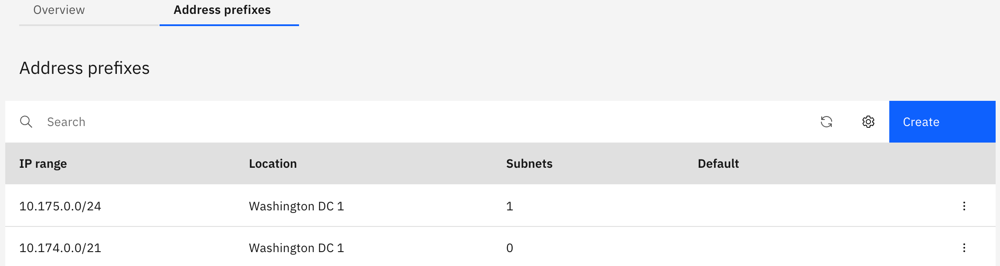

---

copyright:
  years: 2021
lastupdated: "2021-12-01"

subcollection: vpc-journey

---

{{site.data.keyword.attribute-definition-list}}

# Extend to Advanced Elements
{: #vpc-advanced-elements}

## Journey Map
{: #vpc-advanced-elements-map}
{: class="center"}

## Overview
{: #vpc-overview-hub-n-spoke}

If multiple VPCs will be used within the environment a "Hub-n-Spoke" approach may be beneficial.  In this scenario:

- A transit "Hub" VPC serves as a centralized point for routing network traffic to/from the "Spoke" VPCs where workloads are running.
- The transit "Hub" VPC can be managed by your organizations network infrastructure SMEs. Each "Spoke" VPC can be owned by a Project/App Team.
- Traffic to/from on-prem and the "Spoke" VPCs and traffic between the "Spoke" VPCs pass through the VNF(s) in the "Hub" VPC. 
  - VNFs within the VPC may be transparent VNFs like Palo Alto or CheckPoint firewalls, or non-transparent VNFs like F5, etc. and are managed by you.
  - While VPC has native controls such as Subnet ACLs and Security Groups for control traffic, depending on the complexity of your organization, your network team may prefer to leverage centralized VNFs in transit VPC to control the traffic.
- VPC's Custom Routing using ingress/egress rules is used to transit packets to/from the VNF(s) in the "Hub" VPC

  
  

The following architecture depicts a VPC Hub-n-Spoke Topology on the IBM Cloud:

{: class="center"}

## Configuration Steps
- Provision VPC as hub with following prefixes
{: class="center"}
- Provision VNF of your choice. Here using centOS-7 as VNF and enable ip spoofing on the NIC.
- Enable IP forwarding in centOS-7
- Provision VPCs as spokes. 
- Deploy VM-based or container-based clusters on spoke VPCs.
- Provision Transit Gateway
- Add all VPCs (Hub and spokes) as connections to transit gateway
- Define an ingress rule in hub VPC's custom routing table to force packets from on-premise to transit via VNF to reach target workloads
- Define an engress rule in spoke VPC's custom routing table to force the return path from target destined to on-premise to transit via VNF.

## Next Steps
{: #vpc-overview-next-steps}
Additional resources, such as leveraging [Flow Logs](https://{DomainName}/docs/vpc?topic=vpc-flow-logs) for logging VPC traffic is available within our [documentation](https://{DomainName}/docs/vpc?topic=vpc-getting-started).

