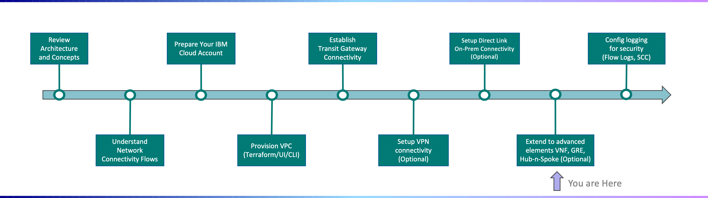

---

copyright:
  years: 2021
lastupdated: "2021-12-01"

subcollection: vpc-journey

---

{{site.data.keyword.attribute-definition-list}}

# Extend to Advanced Elements
{: #vpc-advanced-elements}

## Journey Map
{: #vpc-advanced-elements-map}
{: class="center"}

## Overview
{: #vpc-overview-hub-n-spoke}

If multiple VPCs will be used within the environment a "Hub-n-Spoke" approach may be beneficial.  In this scenario:

- A centralized "Hub" VPC serves as a centralized point for routing network traffic to/from the "Spoke" VPCs where workloads are running.
- The centralized "Hub" VPC can be managed by your organizations network infrastructure SMEs. Each "Spoke" VPC can be owned by a Project/App Team.
- Traffic to/from on-prem and the "Spoke" VPCs and traffic between the "Spoke" VPCs but pass through the VNF(s) in the "Hub" VPC. 
  - VNFs within the VPC may be Palo Alto, CheckPoint, F5, etc. and are managed by you.
  - While VPC has native controls such as Subnet ACLs and Security Groups for control traffic, depending on the complexity of your organization, your network team may prefer to leverage centralized VNFs to control the traffic.
- VNFs within the VPC may be Palo Alto, CheckPoint, F5, etc. and are managed by you.
- VPC Custom Routing is used to force ingress/egress traffic to/from the VNF(s) in the "Hub" VPC.

  
  

The following architecture depicts a VPC Hub-n-Spoke Topology on the IBM Cloud:

{: class="center"}

## Next Steps
{: #vpc-overview-next-steps}
Additional resources, such as leveraging [Flow Logs](https://{DomainName}/docs/vpc?topic=vpc-flow-logs) for logging VPC traffic is available within our [documentation](https://{DomainName}/docs/vpc?topic=vpc-getting-started).

